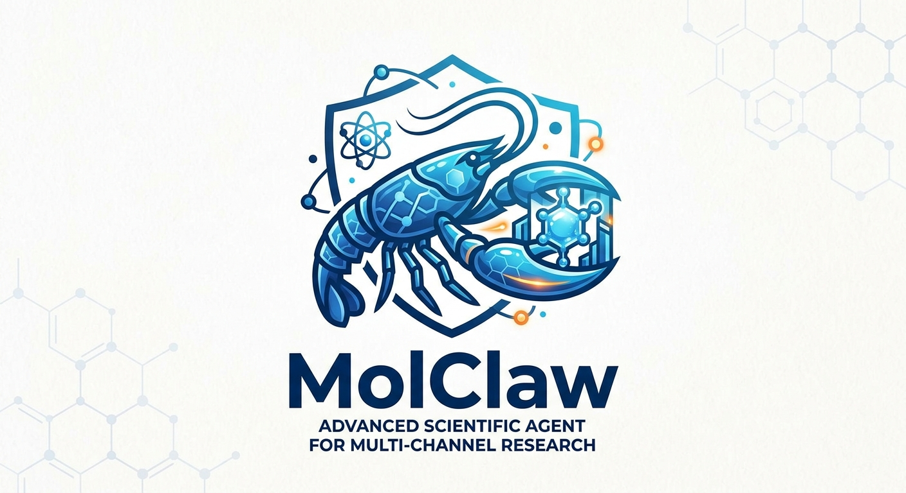
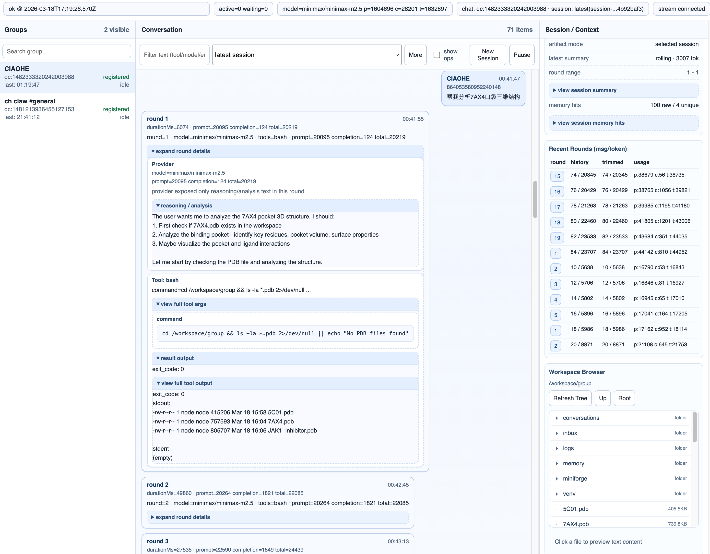

<div align="center">

</div>

# MolClaw

[](https://github.com/IDEA-XL/MolClaw)
[](https://github.com/IDEA-XL/MolClaw/blob/main/LICENSE)


MolClaw is a practical fork of [BioClaw](https://github.com/Runchuan-BU/BioClaw): a containerized, multi-channel research assistant for bioinformatics workflows.

This fork keeps the original BioClaw direction intact while focusing on runtime and productization improvements for day-to-day deployment:

- OpenAI-compatible and OpenRouter providers
- Discord and WhatsApp channels
- Claude-style runtime skills
- session and durable memory
- dashboard observability for agent execution

## Highlights

- What MolClaw adds beyond the upstream baseline:
  - OpenAI-compatible and OpenRouter provider support
  - per-chat provider and model selection via Discord `/models`
  - a real-time dashboard for provider/tool/output tracing
  - round-level execution views, session filtering, and file browsing
  - Claude-style runtime skill loading, routing, and conformance tracing
  - durable memory, memory search/get tools, and rolling session summaries
  - Discord attachment ingestion with multimodal capability fallback
  - cleaner Docker image publishing to GHCR
- Multi-channel runtime:
  - Discord (DM + guild channels)
  - WhatsApp (optional, QR login)
- Provider controls:
  - OpenAI-compatible endpoint support
  - OpenRouter support
  - per-group / per-chat provider-model selection
  - Discord `/models` management flow
- Claude runtime / skills:
  - Claude-style skill registry inside the container runtime
  - Skills can be loaded from bundled `container/skills/` and local `.claude/skills/`
  - Explicit skill invocation support with runtime tracing and conformance checks
  - Dashboard visibility into skill routing, loaded skills, and parse/runtime status
- Memory system:
  - Durable memory tools: `save_memory`, `memory_search`, `memory_get`
  - File-backed memory store with `MEMORY.md` and `memory/YYYY-MM-DD.md`
  - SQLite-backed memory index, memory hits, and session summaries
  - Rolling session summary when transcript approaches token budget
  - Silent pre-compaction memory flush before older context is compressed away
  - Closing session summary archived on reset/new session
- Discord inbound attachments:
  - Images/files are downloaded to per-group workspace (`inbox/discord/<date>/`)
  - Incoming message text includes saved `/workspace/group/...` paths for agent tools
  - Image attachments are forwarded to provider as multimodal `image_url` content when possible
  - If model image input is unsupported, runner auto-falls back to text-only and sends a user notice
- Isolated execution:
  - Per-group Docker container
  - Per-group workspace/session state
- Real-time dashboard:
  - Provider/tool/final-output timeline
  - Round-level aggregation (OpenAI/Gemini-like view)
  - Session-aware filtering (`latest` / `all` / specific session)
  - Session selector defaults to recent 20 sessions with on-demand expand
  - Right-panel round table with one-click jump to timeline round
  - Tree-style workspace file browser (expand/collapse, double-click enter, file preview)
  - Fold-state persistence while new events stream in
  - Context/token usage snapshot
  - Memory hit aggregation and session summary inspection
  - Skill routing / conformance visibility
  - Streaming updates via SSE
- Session controls:
  - Reset session from dashboard
  - Reset session from Discord slash commands: `/newsession`, `/reset_session`, `/reset`
- Output delivery:
  - Discord text replies
  - Discord image file send support (`sendImage`)
- Robust operations:
  - Startup logs include dashboard URL
  - Discord typing heartbeat during long-running jobs
  - Cleaner shutdown for dashboard/stream resources

## Quick Start

### 1. Prerequisites

- Node.js >= 20
- Docker Desktop (daemon running)
- OpenAI-compatible chat-completions endpoint

### 2. Install

```bash
git clone https://github.com/IDEA-XL/BioClaw-openai.git
cd BioClaw-openai
npm install
```

If you rename or mirror this fork under a different repository name, replace the clone URL accordingly.

### 3. Configure

```bash
cp .env.example .env
```

Minimum required in `.env`:

```env
OPENAI_COMPAT_BASE_URL=http://<your-endpoint>/v1
OPENAI_COMPAT_MODEL=<your-model>
# optional if your gateway requires auth:
OPENAI_COMPAT_API_KEY=<your-key>
```

OpenRouter example:

```env
MODEL_PROVIDER=openrouter
OPENROUTER_API_KEY=<your-openrouter-key>
OPENROUTER_BASE_URL=https://openrouter.ai/api/v1
OPENROUTER_MODEL=openai/gpt-4.1-mini
```

Optional model catalog / default provider:

```env
DEFAULT_MODEL_PROVIDER=openrouter
OPENROUTER_MODELS=openai/gpt-4.1-mini,anthropic/claude-3.7-sonnet
OPENAI_COMPATIBLE_MODELS=<model-a>,<model-b>
```

Optional common settings:

```env
# Discord
DISCORD_BOT_TOKEN=<your-discord-bot-token>

# Disable WhatsApp if you only use Discord
WHATSAPP_ENABLED=false

# Dashboard
DASHBOARD_ENABLED=true
DASHBOARD_HOST=127.0.0.1
DASHBOARD_PORT=8787
# DASHBOARD_TOKEN=<optional>

# Optional memory / context tuning
# MOLCLAW_ROLLING_SUMMARY_TRIGGER_TOKENS=24000
# MOLCLAW_ROLLING_SUMMARY_TAIL_MESSAGES=10
# MOLCLAW_DURABLE_MEMORY_PINNED_TOKENS=1000
# MOLCLAW_DURABLE_MEMORY_RECENT_TOKENS=800
# MOLCLAW_DURABLE_MEMORY_MATCHED_TOKENS=1400
# MOLCLAW_SESSION_SUMMARY_TOKENS=2000
```

### 4. Build container image

```bash
./container/build.sh latest
```

### 5. Publish remote image

This repo includes a GitHub Actions workflow that publishes the container to GHCR:

- Workflow: `Publish MolClaw Image`
- Registry: `ghcr.io/idea-xl/molclaw-agent`
- Trigger:
  - push to `main` updates `:latest`
  - push tag like `v0.1.0` publishes `:v0.1.0`
  - `workflow_dispatch` can publish manually

To use it:

1. Push this repo to GitHub.
2. Open `Actions` and allow workflows if GitHub asks.
3. Push to `main`, or create a release tag:

```bash
git tag v0.1.0
git push origin v0.1.0
```

Pull example:

```bash
docker pull ghcr.io/idea-xl/molclaw-agent:latest
```

If you prefer to publish manually from your machine:

```bash
docker tag molclaw-agent:latest ghcr.io/idea-xl/molclaw-agent:latest
echo "$GHCR_TOKEN" | docker login ghcr.io -u <github-username> --password-stdin
docker push ghcr.io/idea-xl/molclaw-agent:latest
```

If you want others to pull the image without authentication, make sure the GitHub package visibility for `molclaw-agent` is set to `public`.

### 6. Start

```bash
npm run build && npm start
```

On startup, logs will print a clickable dashboard URL, for example:

```text
Dashboard: http://127.0.0.1:8787/
```

## Usage

### Discord

- DM the bot directly, or mention it in a guild channel.
- Guild channels auto-register on first message.
- Start a new session with:
  - `/newsession`
  - `/reset_session`
  - `/reset`
- Manage model provider/model for current chat:
  - `/models` (list/show)
  - `/models action:set provider:<id> model:<model>`

Note: your bot invite must include `applications.commands` scope for slash commands.

### Dashboard



- Open the printed URL from startup logs.
- Use `New Session` button to reset the current chat session.
- Timeline supports grouped rounds and expandable tool call/result details.
- Use the session selector to focus `latest`, `all`, or specific sessions.
- Right panel includes:
  - Recent rounds table with jump-to-round buttons
  - Latest model/context/token snapshot
  - Session summary and memory hit inspection
  - Skill routing / conformance status
  - Workspace tree browser for the selected group

### Attachments and multimodal input

- Discord image/file attachments are downloaded into the group workspace.
- Saved file paths are injected into the incoming message so the agent can operate on them directly.
- If the selected provider/model supports image input, Discord images are forwarded as multimodal content.
- If the model is text-only, MolClaw falls back gracefully and emits a user-visible notice instead of silently failing.

### Claude-style Runtime Skills

- Runtime skills are discovered from:
  - `container/skills/`
  - `.claude/skills/`
- Skills are exposed inside the container runtime and can be explicitly invoked by name from the prompt.
- Dashboard shows:
  - selected skills
  - loaded skills
  - skill parse errors
  - post-load tool usage / conformance trace

### Memory

- Durable memory is stored per scope as Markdown plus SQLite metadata.
- Main tools inside the runtime:
  - `save_memory`
  - `memory_search`
  - `memory_get`
- Non-main groups default to writing memory into their own group scope.
- As a session grows, MolClaw:
  - keeps a recent transcript tail
  - rolls older history into a session summary
  - tries a silent memory flush before compaction
- Session resets also archive a closing summary for later review.

## Documentation

- Demo examples: [docs/DEMO_EXAMPLES.md](docs/DEMO_EXAMPLES.md)
- Dashboard plan/history: [docs/DASHBOARD_PLAN.md](docs/DASHBOARD_PLAN.md)
- Memory architecture / roadmap: [docs/MEMORY_V2_PLAN.md](docs/MEMORY_V2_PLAN.md)
- Docker networking notes: [docs/APPLE-CONTAINER-NETWORKING.md](docs/APPLE-CONTAINER-NETWORKING.md)
- Security notes: [docs/SECURITY.md](docs/SECURITY.md)

## Project Structure

```text
.
├── src/                         # orchestrator, channels, queue, dashboard server
│   ├── channels/                # Discord / WhatsApp adapters
│   ├── dashboard/               # dashboard server, helpers, and UI template
│   ├── container-runner.ts      # Docker lifecycle + stream parsing
│   ├── group-queue.ts           # per-group execution queue
│   ├── db.ts                    # SQLite schema + memory/session/event accessors
│   ├── ipc.ts                   # memory/task/message IPC from containers
│   ├── session-rollup.ts        # closing session summary utilities
│   └── index.ts                 # application entrypoint
├── container/
│   ├── Dockerfile               # agent image definition
│   ├── build.sh                 # image build helper
│   ├── skills/                  # bundled Claude-style runtime skills
│   └── agent-runner/            # in-container agent runtime, tools, memory, skills
├── docs/                        # docs and architecture notes
├── groups/                      # per-group workspaces, MEMORY.md, daily memory logs
├── data/                        # runtime state (sessions, ipc, auth)
├── store/                       # SQLite database
└── .env.example                 # environment template
```

## Lineage

MolClaw is part of a shared lineage rather than a disconnected rewrite:

- [BioClaw](https://github.com/Runchuan-BU/BioClaw) established the bioinformatics-oriented assistant experience on top of NanoClaw and STELLA-inspired tooling.
- [NanoClaw](https://github.com/qwibitai/nanoclaw) provided the containerized orchestrator pattern and much of the operational architecture.
- [STELLA](https://github.com/zaixizhang/STELLA) informed the biomedical tool and workflow direction used by BioClaw and downstream forks.

We have had constructive exchanges with the BioClaw group and want to keep that relationship explicit in this repository. If you are evaluating or building on MolClaw, we strongly encourage you to also read and reference the upstream BioClaw project. The two codebases are best understood as complementary work on a shared problem.

## Acknowledgements

MolClaw should be read in the context of the projects it builds on:

- [BioClaw](https://github.com/Runchuan-BU/BioClaw): the direct upstream fork base and the closest conceptual ancestor of this repository.
- [NanoClaw](https://github.com/qwibitai/nanoclaw): the underlying containerized orchestrator pattern and operational architecture.
- [STELLA](https://github.com/zaixizhang/STELLA): a major influence on the biomedical workflow and tool direction used by BioClaw and related work.

If this repository is useful to you, please also star, cite, and read the upstream projects. We view MolClaw and BioClaw as part of a shared open effort rather than competing silos.

## License

MolClaw is distributed under the [MIT License](LICENSE).

The current codebase includes MolClaw work plus portions derived from BioClaw and, transitively, NanoClaw. Please keep those attribution notices intact in downstream copies and forks.