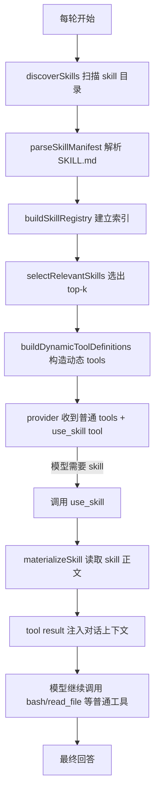

# BioClaw Skill Runtime 实施计划

## 1. 文档目的

这份文档用于把 BioClaw 的 skill 能力从“仅复制 skill 文件到 `.claude/skills`”升级为“模型无关、可索引、可选择、可按需加载”的运行时能力。

目标不是复刻 Claude Code 的全部能力，而是先落地一个可工作的最小闭环，然后为后续增强版预留扩展位。

---

## 2. 当前结论

### 2.1 BioClaw 现在做了什么

当前 BioClaw 只做了 skill 文件同步，没有做 skill runtime。

已确认行为：

- `src/container-runner.ts`
  - 会把 `container/skills/*` 复制到每个 group 的 `data/sessions/<group>/.claude/skills/`
  - 然后把这个 `.claude` 目录挂载进容器的 `/home/node/.claude`
- `container/agent-runner/src/index.ts`
  - system prompt 只读取 `CLAUDE.md`
  - provider 请求只带静态 `TOOL_DEFINITIONS`
  - 没有扫描 `.claude/skills`
  - 没有解析 `SKILL.md`
  - 没有 skill registry
  - 没有 skill selection
  - 没有按需把选中的 skill 内容注入上下文

这意味着：

1. Claude Code CLI 自带的 skill 机制如果不存在，BioClaw 自身不会补上
2. 切到非 Claude 模型时，模型不可能“凭空知道”去读取 `.claude/skills`
3. 当前 skill 目录对 BioClaw runtime 来说基本是死数据

### 2.2 相关源码位置

- `src/container-runner.ts`
  - skill 复制逻辑在 `buildVolumeMounts()` 内
- `container/agent-runner/src/index.ts`
  - `TOOL_DEFINITIONS` 是静态常量
  - `buildSystemPrompt()` 只加载 `CLAUDE.md`
  - `callChatCompletion()` 每轮都把静态 tools 发给 provider

---

## 3. 参考实现结论

## 3.1 Qwen Code 的实现方式

Qwen Code 提供了一个比 Claude Code 更容易阅读的参考实现，核心思路如下：

1. `SkillManager` 扫描 skill 目录，解析 `SKILL.md`
2. 建立内存缓存和 registry
3. 注册一个 `skill` tool
4. 把所有可用 skill 的摘要放进 `skill` tool 的 description
5. 模型如果判断某个 skill 相关，就先调用 `skill` tool
6. runtime 在 tool 调用时才读取并返回对应 skill 正文

Qwen 的关键特征：

- 不是把所有 skill 正文直接塞进上下文
- 是把所有 skill 的 `name + description + level` 放进 tool 描述
- 正文在模型真正选择 skill 时才 materialize
- `allowedTools` 目前只是信息字段，不做真实权限收敛

这是一个可以快速落地的设计。

## 3.2 Claude Code 的实现方式

从 Claude Code bundle 逆向得到的结论是：

- Claude Code 也不是把所有 skill 正文全量放进上下文
- 它先做 skill 元数据索引
- 再根据名称、别名、路径条件等做匹配
- 最后对命中的 skill 懒加载正文

相较 Qwen，Claude Code 更强的点在于：

- skill frontmatter 字段更丰富
- selection/router 更像真正的 registry + activation
- 支持 richer metadata，比如：
  - `when_to_use`
  - `paths`
  - `aliases`
  - `hooks`
  - `disable-model-invocation`
  - `user-invocable`

结论：

- Qwen Code 适合作为 BioClaw v1 的直接蓝本
- Claude Code 适合作为 BioClaw v2 的增强方向

---

## 4. BioClaw 要解决的问题

BioClaw 需要解决的是下面这四步：

1. `discover`
   - 从 skill 目录发现 skill
2. `registry`
   - 解析 metadata，形成可检索索引
3. `selection`
   - 每轮把“相关 skill 摘要”暴露给模型
4. `materialize into context`
   - 模型选中 skill 后，再把 skill 正文注入当前对话

如果缺少任意一步，skill 都无法在非 Claude 模型上稳定工作。

---

## 5. 设计目标

## 5.1 Phase 1 目标

先实现一个模型无关、可用、低复杂度的版本：

- 任何支持 function calling 的 OpenAI-compatible 模型都能使用 skills
- 不依赖 Claude Code 私有 runtime
- 不把所有 skill 正文塞爆上下文
- skill 正文按需加载
- 尽量少改现有 query loop

## 5.2 Phase 2 目标

在 Phase 1 之上增强：

- 支持 richer metadata
- 支持更精准的 shortlist，而不是全量 skill 摘要暴露
- 支持基于路径、显式点名、关键词的选择
- 为将来 per-skill tool policy 和 hooks 留接口

## 5.3 非目标

本次不做：

- 复刻 Claude Code 的全部 slash command 行为
- 完整 hooks 系统
- embedding 检索
- 向量数据库
- 多轮 autonomous skill planner
- per-skill 专属子 agent

---

## 6. 目标架构



---

## 7. Skill 数据模型

建议在 `container/agent-runner/src/skills.ts` 新增如下类型：

```ts
export type SkillSource = 'project' | 'bundled';

export interface SkillManifest {
  name: string;
  description: string;
  allowedTools?: string[];
  whenToUse?: string;
  aliases?: string[];
  paths?: string[];
  disableModelInvocation?: boolean;
  userInvocable?: boolean;
}

export interface SkillRecord {
  manifest: SkillManifest;
  filePath: string;
  baseDir: string;
  body: string;
  source: SkillSource;
}

export interface SkillSummary {
  name: string;
  description: string;
  source: SkillSource;
  aliases?: string[];
  whenToUse?: string;
  paths?: string[];
}

export interface SkillRegistry {
  byName: Map<string, SkillRecord>;
  all: SkillRecord[];
}
```

说明：

- Phase 1 真正必须的字段只有：
  - `name`
  - `description`
  - `allowedTools`
  - `filePath`
  - `baseDir`
  - `body`
- 其余字段即使 Phase 1 不用，也建议先定义好类型，为 Phase 2 留接口

---

## 8. 目录来源设计

## 8.1 Phase 1 skill 来源

先只支持两类来源：

1. project skill
   - `/home/node/.claude/skills/*/SKILL.md`
2. bundled skill
   - `/app/src` 对应宿主仓库里的 `container/skills/` 映射进来的 skill

建议统一后只从容器内最终可见目录读取，避免 host/container 双重概念混淆。

最简单方案：

- 只读 `/home/node/.claude/skills`

原因：

- 这是 `src/container-runner.ts` 已经同步好的最终目录
- 不需要额外处理宿主和容器路径映射
- 多 group 隔离已经天然存在

## 8.2 后续可扩展来源

后续可以扩展：

- `/workspace/group/.bioclaw/skills`
- `/workspace/project/.bioclaw/skills`
- extension-like skills
- system skills

但 v1 不需要同时做。

---

## 9. 解析规则

## 9.1 SKILL.md 格式

推荐沿用 Qwen/Claude 现有习惯：

```md
---
name: pdf
description: Extract text and tables from PDF files. Use when the user asks about PDF parsing, forms, or OCR-like extraction.
allowedTools:
  - bash
  - read_file
when_to_use: Use for PDF extraction and processing tasks.
aliases:
  - document-pdf
paths:
  - data/**/*.pdf
---

# PDF Skill

具体操作说明...
```

## 9.2 Phase 1 解析字段

Phase 1 先解析：

- `name`
- `description`
- `allowedTools`
- `when_to_use`
- `aliases`
- `paths`
- `disable-model-invocation`
- `user-invocable`

其中真正参与逻辑的最小字段只有：

- `name`
- `description`

其余字段可以先解析但不启用全部逻辑。

## 9.3 错误处理

要求：

- 单个 skill 解析失败不能导致整个 query 失败
- 要记录 parse error
- `use_skill` 找不到 skill 时，返回明确错误信息

建议新增：

```ts
export interface SkillParseError {
  filePath: string;
  message: string;
}
```

---

## 10. Selection 策略

## 10.1 Phase 1 策略

Phase 1 不做复杂 router，采用 Qwen-like 简化策略：

- 每轮把全部 skill 摘要放进一个动态 tool `use_skill` 的 description
- 模型自行决定是否先调用 `use_skill`

优点：

- 改动最小
- 很快能工作
- 与模型无关

缺点：

- skills 数量很多时，tool description 会变大
- selection 精度依赖模型自己理解 `description`

## 10.2 Phase 2 策略

Phase 2 增加 `selectRelevantSkills()`，只把 shortlist 暴露给模型。

建议打分规则：

1. 显式点名命中
   - 用户输入直接出现 `skill name`
2. alias 命中
3. `paths` 命中
   - 最近工具访问路径、用户提到的路径、工作区文件命中 glob
4. 关键词重合
   - `prompt/history` 与 `description/whenToUse` 的 lexical overlap
5. 默认兜底
   - 若无明显命中，暴露 top-N 个常用或全部摘要中的前 N 个

建议：

- top-k 默认值为 `8`
- 若总 skill 数 <= 8，则全部暴露

---

## 11. Context 控制策略

这是整个设计里最重要的部分。

## 11.1 为什么不会撑爆上下文

因为 skill 内容分两层：

1. 摘要层
   - 每轮只给模型看 `name + description + 少量元数据`
2. 正文层
   - 只有模型调用 `use_skill` 时，才把对应 skill 正文注入上下文

所以不会出现“所有 skill 正文全量进 prompt”的问题。

## 11.2 Phase 1 上下文开销

每轮增加的上下文来自：

- 一个 `use_skill` tool schema
- schema description 中的 skills 摘要列表

因此 v1 要控制每个 skill 摘要长度：

- `name` 不截断
- `description` 建议限制在 `160` 字符以内
- `whenToUse` 建议限制在 `200` 字符以内

## 11.3 Phase 2 上下文进一步优化

Phase 2 用 shortlist 后，可把摘要预算进一步压缩。

建议：

- 每轮最多暴露 `8` 个 skills
- 每个 skill 摘要文本不超过 `300` 字符
- tool description 总预算控制在 `4k-8k chars`

---

## 12. Tool 设计

## 12.1 新增工具

建议新增一个 runtime tool：

- `use_skill`

参数：

```json
{
  "type": "object",
  "properties": {
    "skill_name": {
      "type": "string",
      "description": "Exact skill name to load."
    }
  },
  "required": ["skill_name"]
}
```

## 12.2 Tool description

示例：

```text
Load a skill into the current conversation.

When a user request matches one of the available skills below, call this tool
before continuing with normal tools.

Available skills:
- pdf: Extract text and tables from PDF files.
- office: Work with docx, xlsx, pptx files.
- review: Review code for bugs, regressions, and missing tests.
```

## 12.3 Tool 执行结果

`use_skill("pdf")` 执行后，tool result 建议返回：

```text
Base directory for this skill: /home/node/.claude/skills/pdf
Important: resolve any referenced scripts or files from this base directory.

<SKILL BODY HERE>
```

这和 Qwen 的做法一致，易于模型理解。

---

## 13. 对现有代码的具体改动

## 13.1 新增文件

新增：

- `container/agent-runner/src/skills.ts`

职责：

- `discoverSkills()`
- `parseSkillContent()`
- `buildSkillRegistry()`
- `listSkillSummaries()`
- `selectRelevantSkills()`
- `materializeSkill()`
- `buildSkillToolDefinition()`

## 13.2 修改文件：`container/agent-runner/src/index.ts`

需要改动的点：

### A. 替换静态 `TOOL_DEFINITIONS`

当前：

- `TOOL_DEFINITIONS` 是顶层常量

改为：

- 保留 `CORE_TOOL_DEFINITIONS`
- 新增 `buildToolDefinitions(dynamicSkillsContext)` 函数
- 每轮在调用 provider 前动态生成 tools

建议结构：

```ts
const CORE_TOOL_DEFINITIONS: ToolDefinition[] = [ ... ];

function buildToolDefinitions(skillTool?: ToolDefinition): ToolDefinition[] {
  return skillTool
    ? [...CORE_TOOL_DEFINITIONS, skillTool]
    : CORE_TOOL_DEFINITIONS;
}
```

### B. 在 query loop 内构建 skill registry

建议在每轮 provider 调用前做：

```ts
const skillRegistry = await discoverSkills('/home/node/.claude/skills');
const shortlistedSkills = selectRelevantSkills(skillRegistry, {
  prompt,
  sessionMessages: trimmedMessages,
});
const skillTool = buildSkillToolDefinition(shortlistedSkills);
const tools = buildToolDefinitions(skillTool);
```

### C. 修改 `callChatCompletion()`

当前 `callChatCompletion()` 内直接引用静态 `TOOL_DEFINITIONS`。

改为：

```ts
async function callChatCompletion(
  providerConfig: ProviderConfig,
  messages: ChatMessage[],
  tools: ToolDefinition[],
): Promise<...>
```

并在 payload 中使用传入参数：

```ts
const payload = {
  model: providerConfig.model,
  messages: providerMessages,
  tools,
  tool_choice: 'auto',
  ...
};
```

### D. 新增 `use_skill` executor

在 `TOOL_EXECUTORS` 中增加：

```ts
async use_skill(args) {
  const skillName = ensureString(args.skill_name, 'skill_name');
  const skill = await materializeSkill(skillName);
  return `Base directory for this skill: ${skill.baseDir}\n...`;
}
```

### E. 增加 progress 埋点

建议增加 skill 相关埋点：

- `toolName = use_skill`
- `argsSummary = skill_name=pdf`
- 输出中保留 skill 加载结果摘要

这样 dashboard 能直接观测 skill 是否被模型触发。

## 13.3 修改文件：`src/container-runner.ts`

Phase 1 可以不改 skill 同步逻辑，只要保证：

- `container/skills/*` 能正确同步到 `/home/node/.claude/skills/*`

但建议补两点：

1. 同步时允许子目录一起复制
   - 不能只复制顶层文件
   - 因为 skill 未来可能包含 `scripts/`、`assets/`、`templates/`
2. 明确只复制 skill 目录，而不是松散 markdown 文件

当前如果 `container/skills/<skill>/` 下出现子目录，简单 `copyFileSync` 不够，需要递归复制。

这是一个必须修的点，否则 skill body 中引用的脚本和资源文件会在容器里缺失。

---

## 14. 推荐的函数签名

建议在 `container/agent-runner/src/skills.ts` 中定义：

```ts
export async function discoverSkills(baseDir: string): Promise<SkillRegistry>;

export function parseSkillContent(
  content: string,
  filePath: string,
): SkillRecord;

export function selectRelevantSkills(
  registry: SkillRegistry,
  input: {
    prompt: string;
    sessionMessages: ChatMessage[];
    maxSkills?: number;
  },
): SkillSummary[];

export function buildSkillToolDefinition(
  skills: SkillSummary[],
): ToolDefinition | null;

export async function materializeSkill(
  registry: SkillRegistry,
  skillName: string,
): Promise<SkillRecord | null>;
```

Phase 1 可以简单实现：

- `discoverSkills()` 每轮重新扫描
- `selectRelevantSkills()` 直接返回全部 skill summaries
- `materializeSkill()` 直接 `registry.byName.get(skillName)`

Phase 2 再加缓存和 smarter selection。

---

## 15. 分阶段实施计划

## Phase 1：Qwen-like 最小可用版

### 目标

让 BioClaw 在任意支持 function calling 的模型上，都能按需使用 `.claude/skills`。

### 实施项

1. 新增 `container/agent-runner/src/skills.ts`
2. 解析 `/home/node/.claude/skills/*/SKILL.md`
3. 为 skills 建立 registry
4. 新增 `use_skill` tool
5. 每轮 provider 调用前动态构造 tools
6. `use_skill` 被调用时，把目标 skill 正文返回给模型
7. 增加 skill 相关日志和 progress 埋点
8. 修复 `src/container-runner.ts` 的递归复制问题

### 完成标准

- skill 不再依赖 Claude-only runtime
- 非 Claude provider 也能成功使用 skill
- 大量 skill 正文不会直接进入每轮 prompt
- `use_skill` 调用结果可在日志和 dashboard 中看到

## Phase 2：Claude-like 增强版

### 目标

降低上下文开销，提高 skill 路由精度。

### 实施项

1. 增加 `when_to_use / aliases / paths` 元数据支持
2. 实现 `selectRelevantSkills()`
3. 只把 shortlist 暴露给模型
4. 给 selection 增加 deterministic 评分逻辑
5. 预留 per-skill policy/hook 字段

### 完成标准

- 每轮上下文只暴露 top-k skills
- 命中率高于全量暴露
- skill 数量提升后 context 仍稳定

---

## 16. 详细任务拆解

## Task 1：实现 skill 目录扫描与解析

### 输入

- `/home/node/.claude/skills`

### 输出

- `SkillRegistry`

### 必做项

- 忽略非目录项
- 忽略没有 `SKILL.md` 的目录
- 单个 skill 解析失败不影响其他 skill
- 支持 UTF-8/BOM/CRLF

### 测试

- 正常 skill 可被发现
- 缺 frontmatter 的 skill 被忽略并报错
- 缺 `name`/`description` 的 skill 被忽略并报错

## Task 2：实现动态 skill tool

### 输入

- `SkillSummary[]`

### 输出

- `ToolDefinition`

### 必做项

- 无 skills 时，不生成 `use_skill`
- 有 skills 时，description 中列出 skills 摘要
- 参数只接受精确 `skill_name`

### 测试

- `use_skill` 出现在 provider payload 中
- skills 数量变化时 description 随之变化

## Task 3：实现 `use_skill` 执行器

### 输入

- `skill_name`

### 输出

- skill 正文 + base directory

### 必做项

- skill 不存在时返回明确错误
- skill 存在时返回完整 body
- 返回 base directory 供模型解析脚本/资源相对路径

### 测试

- `use_skill(pdf)` 返回正确正文
- `use_skill(missing)` 返回 not found

## Task 4：接入 query loop

### 必做项

- 每轮 provider 调用前构建 skill registry
- 动态生成 tools
- provider 请求不再依赖固定 `TOOL_DEFINITIONS`

### 测试

- 不带 skill 时行为不回归
- 带 skill 时模型能看到 `use_skill`

## Task 5：修复 skill 资源复制

### 必做项

- 将 `src/container-runner.ts` 的 skill 同步改为递归复制
- 确保 `scripts/`, `templates/`, `assets/` 等子目录也能进入容器

### 测试

- skill 下脚本文件能在容器内被看到
- skill body 中引用的相对路径在容器中存在

---

## 17. 运行约束在哪里

目前这些运行约束不在 skill 里，而是在 BioClaw runtime 代码里：

- 最大 tool 轮数
- tool 输出长度上限
- 文件读取长度上限
- `bash` 超时
- provider `max_tokens`
- 图片输入数量限制

这意味着：

- skill 只是“额外的指令包”
- 真正的运行安全边界仍由 runtime 控制
- 这和 Claude/Qwen 的总体设计是一致的

结论：

- 不应该把“timeout、权限、最大轮数”写死在 `SKILL.md`
- 这些属于 runtime policy，不属于 skill 内容

后续如果要支持 per-skill policy，建议做“附加限制”，不是替换全局限制。

---

## 18. 测试计划

## 18.1 单元测试

建议新增：

- `container/agent-runner/src/skills.test.ts`

覆盖：

1. `parseSkillContent()`
2. `discoverSkills()`
3. `selectRelevantSkills()`
4. `buildSkillToolDefinition()`
5. `materializeSkill()`

## 18.2 集成测试

建议做以下场景：

### 场景 A：普通问题

输入：

- 一个与 skills 无关的普通问题

预期：

- 模型不一定调用 `use_skill`
- 现有工具行为不回归

### 场景 B：显然命中某 skill

输入：

- 一个明显与 skill 描述匹配的问题

预期：

- 模型先调用 `use_skill`
- 再继续使用 `bash/read_file/...`

### 场景 C：skill 不存在

输入：

- 模型误调用了不存在的 `skill_name`

预期：

- runtime 返回明确错误
- 会话不崩

### 场景 D：skill 包含资源文件

输入：

- skill body 引用了 `scripts/helper.py`

预期：

- 容器中存在这个文件
- 模型可以使用绝对路径调用它

## 18.3 手工验证

建议在一个测试 skill 上验证：

```md
---
name: review
description: Review code for bugs, regressions, and missing tests.
---

Review code with emphasis on:
- correctness
- regressions
- missing tests
```

手工提问：

- “帮我 review 这个改动”

检查：

1. provider payload 中出现 `use_skill`
2. 模型先调 `use_skill("review")`
3. tool result 返回 skill 正文
4. 后续模型继续调用文件读取或 grep 工具

---

## 19. 风险与应对

## 风险 1：skills 太多导致 tool description 过大

应对：

- Phase 1 先接受
- Phase 2 上 shortlist

## 风险 2：模型不主动调用 `use_skill`

应对：

- 在 `use_skill` description 中明确要求：
  - 如果某个 skill 相关，先调用 `use_skill`
- 在 system prompt 中增加一条短规则，提醒优先使用相关 skills

## 风险 3：skill 正文过长

应对：

- 允许 `SKILL.md` 长，但只在选中时注入
- 如未来出现极长 skill，可再加 body 截断或引用文件按需读取

## 风险 4：skill 引用的资源文件没有同步进容器

应对：

- 必须修复递归复制
- 增加集成测试

## 风险 5：每轮重新扫描 skills 有性能损耗

应对：

- Phase 1 先接受
- skill 数量通常较少
- Phase 2 再做缓存或 mtime-based refresh

---

## 20. 推荐实施顺序

建议严格按以下顺序做，避免把问题搅在一起：

1. 修复 skill 目录递归复制
2. 新增 `skills.ts` 并实现解析/发现
3. 新增 `use_skill` tool 定义和 executor
4. 把 provider tools 改成动态构造
5. 跑单元测试
6. 跑一轮手工联调
7. 再决定是否做 Phase 2 shortlist

不要一开始就做复杂 router。先让闭环工作，再优化。

---

## 21. Done Definition

满足以下条件，Phase 1 才算完成：

1. BioClaw 不再依赖 Claude Code 私有 skill runtime
2. `SKILL.md` 能被 runtime 扫描和解析
3. provider 每轮能看到 `use_skill` tool
4. 模型命中 skill 时能通过 `use_skill` 把 skill 正文注入上下文
5. 非 Claude provider 下也能工作
6. skill 资源文件能递归同步到容器
7. 不影响现有普通工具调用链路
8. 有基础测试覆盖和手工验证记录

---

## 22. 建议后续文档联动

这份文档落地后，建议同步更新：

1. `docs/SPEC.md`
   - 增加 BioClaw 原生 skill runtime 说明
2. `README.md`
   - 增加如何编写 `container/skills/<name>/SKILL.md`
3. `docs/DEBUG_CHECKLIST.md`
   - 增加 “为什么模型没触发 skill” 的排查项

---

## 23. 一句话总结

BioClaw 现在的问题不是“非 Claude 模型不支持 `.claude/skills`”，而是“BioClaw 自己还没有实现 skill runtime”。

最务实的方案是：

- 先按 Qwen 的方式做一个 `use_skill` 工具，把 skill 摘要暴露给模型
- 被选中时再加载 skill 正文
- 后续再按 Claude Code 的方向增加 richer metadata 和 shortlist router

---

## 24. 当前实施状态（2026-03-17）

### 已完成

- Phase 1 的核心闭环已落地：
  - 已实现 `.claude/skills` discovery
  - 已实现 `SKILL.md` frontmatter 解析
  - 已实现 skill registry
  - 已实现 shortlist selection
  - 已实现动态 skill tool 注入
  - 已实现按需 materialize skill 正文
  - 已实现宿主到容器的 skill 递归复制
- 已补基础测试，覆盖：
  - 解析
  - discover
  - alias lookup
  - selection
  - tool definition
  - materialize smoke flow

### 部分完成

- Phase 2 已有基础雏形：
  - 已支持 `aliases`
  - 已支持 `paths`
  - 已支持 `disable-model-invocation`
  - 已支持 `user-invocable`
  - 已支持 `model` gating
  - 已支持显式 skill 调用参数透传
  - 已支持 `arguments` / `hooks` 元数据在 materialize 文本中暴露
  - 已支持显式命名和路径加权 selection
  - 已增加 selection 调试信息输出
- 已完成一轮集成 smoke 测试：
  - `discover -> shortlist -> dynamic tool -> materialize`
- 已把 skill selection trace 接到现有 dashboard / event timeline
- 但还没有实现：
  - 更完整的 Claude Code 风格 activation/router
  - hooks
  - per-skill policy gating
  - model-specific skill activation

### 仍未完成

- 真实容器内、真实 provider 下的端到端 smoke 验证
- dashboard / 日志面板中的 skill 专项可视化
- 更完整的 `user-invocable` / `arguments` / `model` 行为语义
